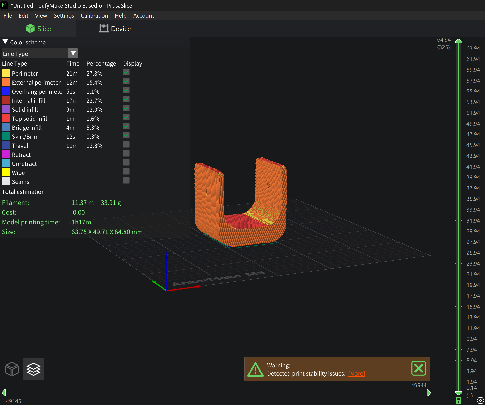

# RobotArm-3DPrint

## STL Conversion
This repository includes the converted STL file of the robot arm holder from last week's design.

- File Name: `Arm Holder.stl`
- Converted from original CAD model to `.stl` format

---

## Slicing the Model
The STL file was imported into **eufyMake Studio (based on PrusaSlicer)**.

### Printer Settings:
- **Printer:** AnkerMake M5 with 0.4 mm nozzle
- **Filament:** AnkerMake PLA+ Basic (White)
- **Quality:** Normal mode (balance between speed and precision)
- **Estimated Print Time:** 1 hr 17 min
- **Filament Required:** 11.37 meters (~33.91 grams)
- **Model Dimensions:** 63.75 x 49.71 x 64.80 mm

---

## Print Settings Preview

---

## Material Selection: PLA+
### Why PLA+?
I chose **PLA+** as the printing material for the following reasons:
- Excellent dimensional accuracy and print quality
- Minimal warping and good layer adhesion
- Easy to print with, even for beginners
- Ideal for static structural parts like a robotic arm holder
- Readily available and cost-effective

---

## Files Included:
| File Name        | Description                                  |
|------------------|----------------------------------------------|
| `Arm Holder.stl` | 3D model of the robotic arm holder (STL)     |
| `settings.png`   | Screenshot of slicing setup and parameters   |
| `README.md`      | Description, settings, and material choice   |

---

## GitHub Repository
Please find all files and documentation in this repository.  
Feel free to fork, download, or test the model using your own slicer and material preferences.
